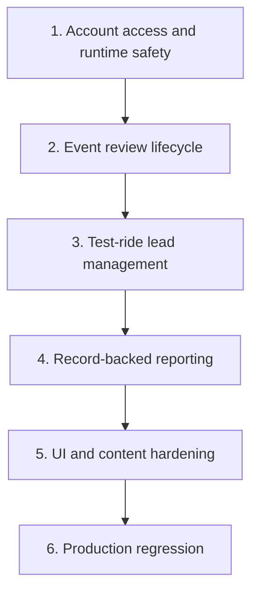

# Tambike Production Hardening Roadmap Implementation Plan

> **For agentic workers:** REQUIRED SUB-SKILL: Use superpowers:subagent-driven-development (recommended) or superpowers:executing-plans to implement this plan task-by-task. Steps use checkbox (`- [ ]`) syntax for tracking.

**Goal:** Execute the approved Tambike production-hardening design in controlled vertical slices, with a passing evidence gate after each slice and one final full-route regression.

**Architecture:** Six focused implementation plans form a dependency chain. Account access and production runtime safety establish the authorization foundation; event review, lead management, and reporting add real persisted workflows; UI/content hardening removes prototype residue after behavior is truthful; final regression proves the combined product. Each plan is independently reviewable and commits narrowly scoped changes.

**Tech Stack:** Next.js 16.2.11; React 19.2.4; TypeScript 5; Prisma 7.8.0; PostgreSQL; Zod 4.4.3; Vitest 4.1.9; ESLint; Codex browser.

## Global Constraints

- The approved design is `docs/superpowers/specs/2026-07-31-tambike-production-ui-hardening-design.md`.
- Follow the six plans in order unless a plan explicitly says tasks can overlap.
- Before editing Next.js behavior, read the relevant installed guide under `node_modules/next/dist/docs/`.
- Use test-driven steps and the exact focused verification commands in each plan.
- Preserve dirty worktree changes and stage only files named by the current task.
- Never create an AI/Codex branch or worktree.
- Reuse an existing dev server when it belongs to this checkout and is healthy.
- Browser verification uses only the Codex browser surface; do not run Playwright.
- Do not mutate, migrate, seed, clean, or test against a remote/live database without separate explicit environment approval.
- Do not deploy or promote production as an implied part of implementation.
- Do not proceed to the next slice while the current slice gate is red.
- When a gate reveals an unrelated pre-existing defect, record it and keep the fix separate; do not hide it in the active slice.

---

## Execution Order



### Plan 1: Account Access and Runtime Safety

[`2026-07-31-tambike-account-access-plan.md`](./2026-07-31-tambike-account-access-plan.md)

Delivers:

- production backend fails closed without a configured database;
- durable account suspension/restoration;
- immediate session revocation;
- reason/audit history;
- self-suspension and last-admin safeguards;
- real admin user UI with reload persistence.

Exit gate:

- focused memory and Prisma tests pass;
- role/session guards pass;
- type-check, lint, and build pass;
- Codex browser proves second-session revocation and restoration.

### Plan 2: Event Review Lifecycle

[`2026-07-31-tambike-event-review-plan.md`](./2026-07-31-tambike-event-review-plan.md)

Depends on: Plan 1.

Delivers:

- durable request-changes, resubmit, reject, publish, disable, and restore transitions;
- required reasons and immutable decision history;
- optimistic concurrency;
- duplicate-rejected-submission-as-draft;
- truthful admin/organizer/public state.

Exit gate:

- lifecycle matrix passes in memory and Prisma;
- stale transitions conflict safely;
- browser reloads preserve every state;
- disabled events disappear publicly and block new RSVPs.

### Plan 3: Test-Ride Lead Management

[`2026-07-31-tambike-lead-management-plan.md`](./2026-07-31-tambike-lead-management-plan.md)

Depends on: Plans 1 and 2.

Delivers:

- real guest/rider test-ride submission;
- normalized deduplication and idempotency;
- event-owner/admin masked list, audited reveal, status, and CSV export;
- 90-day configurable in-place anonymization;
- removal of batch upload, fake validation rows, and simulated success UI.

Exit gate:

- authorization, dedupe, rate-limit, audit, CSV, and retention tests pass;
- no fake lead/upload code remains;
- mobile lead surfaces have no page overflow;
- browser reload proves persisted submission and status.

### Plan 4: Record-Backed Reporting

[`2026-07-31-tambike-reporting-plan.md`](./2026-07-31-tambike-reporting-plan.md)

Depends on: Plans 1–3.

Delivers:

- shared 7/30/90-day report contract;
- timezone-correct dense buckets;
- real admin, organizer, and event-level metrics;
- matching cards, charts, tables, and CSVs;
- honest empty periods;
- removal of hard-coded July chart data and demo fallbacks.

Exit gate:

- memory and disposable Prisma totals agree;
- owner/admin scopes are enforced;
- visible totals equal CSV totals;
- browser range selection survives reload.

### Plan 5: UI and Content Hardening

[`2026-07-31-tambike-ui-content-hardening-plan.md`](./2026-07-31-tambike-ui-content-hardening-plan.md)

Depends on: Plans 1–4.

Delivers:

- accurate metadata and headings for all 41 route patterns;
- natural product copy with internal-policy language removed;
- simplified header/footer and role navigation;
- skip link, focus, touch-target, and semantic error-state fixes;
- consistent attendee/privacy counts;
- useful raw-link/unavailable-state replacements;
- responsive admin, organizer, report, and lead surfaces.

Exit gate:

- metadata/copy/accessibility/responsive contracts pass;
- no known prototype strings or demo static params remain;
- all route patterns have a verified title, description, and `h1`;
- known dense pages have no page-level overflow at 320px.

### Plan 6: Production Regression

[`2026-07-31-tambike-production-regression-plan.md`](./2026-07-31-tambike-production-regression-plan.md)

Depends on: Plans 1–5.

Delivers:

- read-only test-artifact audit;
- complete automated gate;
- proven disposable database/browser fixture boundary;
- 41-route role/state/viewport matrix;
- mutation, reload, concurrency, and session-revocation verification;
- dated QA evidence report;
- explicit local/deployment/production readiness boundary.

Exit gate:

- no unresolved P0/P1/P2 findings;
- unit/server, Prisma integration, type-check, lint, and build pass;
- all 41 route patterns are recorded;
- workflow and viewport matrices pass;
- final report contains no unsupported production claim.

---

### Task 1: Confirm the Starting Boundary

**Files:**
- Read: approved design and all six plans.
- Modify: none.

- [ ] **Step 1: Read the approved design**

```powershell
Get-Content -Raw 'docs/superpowers/specs/2026-07-31-tambike-production-ui-hardening-design.md'
```

- [ ] **Step 2: Read all implementation plans**

```powershell
Get-ChildItem 'docs/superpowers/plans/2026-07-31-tambike-*-plan.md' |
  Where-Object { $_.Name -ne '2026-07-31-tambike-production-hardening-roadmap.md' } |
  Sort-Object Name |
  ForEach-Object { Get-Content -Raw $_.FullName | Out-Null; Write-Output $_.Name }
```

Expected: the six subsystem plan names print with no read error.

- [ ] **Step 3: Record current Git state**

```powershell
git status --short
git branch --show-current
git rev-parse HEAD
```

Expected: current changes are understood and preserved. Do not reset or stash them.

- [ ] **Step 4: Confirm database safety**

Inspect backend mode and redacted database host/name. If the database is remote/live, all browser QA remains read-only until separate explicit approval.

---

### Task 2: Execute Plans 1–4 as Vertical Slices

**Files:**
- Follow each linked plan exactly.

- [ ] **Step 1: Execute and gate Plan 1**

Use every checkbox in the account plan. Stop at its gate until all checks pass.

- [ ] **Step 2: Review the Plan 1 staged diff before each commit**

```powershell
git diff --cached --name-only
git diff --cached --check
```

Expected: only task-owned files; no whitespace errors.

- [ ] **Step 3: Execute and gate Plan 2**

Start only after Plan 1 is green. Re-run the account role/session tests when event actions add new authenticated entry points.

- [ ] **Step 4: Execute and gate Plan 3**

Start only after Plan 2 is green. Verify public event eligibility uses the durable lifecycle, not UI status.

- [ ] **Step 5: Execute and gate Plan 4**

Start only after Plan 3 is green. Use persisted lead/event/account state as reporting inputs.

- [ ] **Step 6: Run a cumulative server check**

```powershell
npm run test:server
npx tsc --noEmit
```

Expected: pass before beginning UI-wide cleanup.

---

### Task 3: Execute the UI and Content Hardening Slice

**Files:**
- Follow the linked UI/content plan exactly.

- [ ] **Step 1: Re-read current behavior before rewriting copy**

Open each affected page in Codex browser and confirm the implemented behavior. Copy must match what the product now does.

- [ ] **Step 2: Execute all UI/content tasks**

Keep semantic/metadata work in Server Components and interactive behavior in focused Client Components. Do not move an entire page client-side solely to reuse state.

- [ ] **Step 3: Run the UI slice gate**

Run the exact contract, source scan, route metadata, viewport, type-check, lint, and build checks in Plan 5.

- [ ] **Step 4: Review cumulative diff**

```powershell
git diff --stat
git log --oneline --decorate -12
```

Expected: coherent slice commits; unrelated user changes remain untouched.

---

### Task 4: Execute Full Production Regression

**Files:**
- Follow the linked regression plan exactly.

- [ ] **Step 1: Prove runtime and database identity**

Do this before any browser mutation. Do not rely on a task name, port number, or `.env` file alone.

- [ ] **Step 2: Run the complete automated gate**

Record every command and result in the QA report.

- [ ] **Step 3: Run all route and workflow matrices**

Use Codex browser only. Check reloads and role changes, not just the initial render.

- [ ] **Step 4: Resolve every release-stopping finding**

Fix and reverify all P0/P1/P2 defects. Keep each fix in a narrow commit and update the report with before/after evidence.

- [ ] **Step 5: Finalize the QA report**

State exactly which evidence levels passed and which actions were not performed.

---

### Task 5: Final Cumulative Verification

**Files:**
- Verify only; fix any remaining scoped defect before declaring completion.

- [ ] **Step 1: Run the full local gate one last time**

```powershell
npm run db:generate
npm run test:server
npm run test:prisma:prepare
npm run test:prisma
npx tsc --noEmit
npm run lint
npm run build
```

Expected: all exit 0 against the proven disposable database.

- [ ] **Step 2: Run the obsolete-behavior scan**

```powershell
rg -n "Codex Smoke|lead@example\\.com|Seeded Tambike Lead|setSaved\\(true\\)|userStatusOverrides|eventStatusOverrides|ValidationSection|FileUpload06|getChartData|ChartAreaInteractive|generateStaticParams|autoFocus" src prisma
```

Expected: no application/seed matches representing removed behavior.

- [ ] **Step 3: Verify plan/spec coverage**

The final QA report must include evidence for:

- reversible suspension and immediate revocation;
- full event review lifecycle;
- real lead capture, privacy, export, and retention;
- real report ranges and matching totals;
- all 41 route patterns;
- guest/rider/organizer/admin boundaries;
- 320/390/tablet/desktop behavior;
- metadata, heading, empty/error, console, and overflow checks.

- [ ] **Step 4: Confirm clean staging discipline**

```powershell
git status --short
git diff --cached --name-only
git diff --cached --check
```

Expected: no accidental staging and no unresolved task-owned changes.

- [ ] **Step 5: Use the correct completion statement**

When deployment and production were not separately authorized:

```text
Tambike is production-ready at the local code, disposable database, and browser
QA levels documented in the dated report. Deployment, remote migration,
live-data cleanup, and production promotion remain separate actions.
```

Do not broaden this statement.
