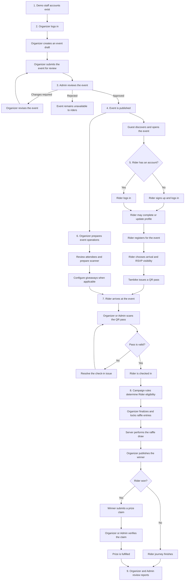

# Tambike Role Process Flow and Browser Smoke Runbook

## Purpose

This document defines the dependency-ordered Tambike MVP process across the
Guest, Rider, Organizer, and Admin experiences. It also provides checkpoints
for a later Codex Browser smoke test.

The MVP has three authenticated account roles: `rider`, `organizer`, and
`admin`. Guest is a public actor, not an account role. There is no Venue role
or public Organizer registration flow.

## Demo accounts

These credentials are for the current demo environment only. Rotate or remove
them before treating the site as a production system.

| Role | Email | Password | Expected landing page |
| --- | --- | --- | --- |
| Organizer | `organizer@bayanko.ph` | `password123` | `/organizer/dashboard` |
| Admin | `admin@bayanko.ph` | `secret_123` | `/admin` |

Riders create their own accounts through `/signup`.

## Dependency-ordered process



## Required order and handoffs

| Order | Owner | Required action | Unlocks |
| ---: | --- | --- | --- |
| 1 | Platform | Organizer and Admin accounts exist | Staff workspace access |
| 2 | Organizer | Create and submit an event | Admin review |
| 3 | Admin | Approve and publish the event | Public discovery and Rider registration |
| 4 | Guest/Rider | Sign up or log in | Profile, RSVP, and pass access |
| 5 | Rider | Register for the published event | QR pass generation |
| 6 | Organizer | Prepare attendees, scanner, and giveaways | Event-day operations |
| 7 | Rider and Organizer/Admin | Present and scan a valid QR pass; staff may use the approved operational override | Confirmed attendance |
| 8 | Organizer/Admin | Lock entries, draw, and publish a winner | Prize claiming |
| 9 | Winner and Organizer/Admin | Submit, verify, and fulfil the claim | Completed giveaway |
| 10 | Organizer/Admin | Open event reports | Final attendance and activity results |

## Role flows and expected routes

### Guest

```text
Open Tambike (/)
-> Browse events (/events)
-> Open a published event (/events/:eventId)
-> View public attendee preview and raffle details
-> Select Register
-> Continue to login or signup
```

Guest checkpoints:

- Public pages load without an authenticated session.
- Only published events are discoverable.
- Registering requires a Rider account.
- Private account and operational data are not shown.

### Rider

```text
Sign up (/signup) or log in (/login)
-> Complete or update profile (/profile)
-> Open a published event (/events/:eventId)
-> Register (/events/:eventId/register)
-> Choose direct arrival or test-ride meetup
-> Choose visible or anonymous RSVP
-> Receive a pass (/passes/:passId)
-> Present the QR pass at the event
-> View past event passes (/passes/past/:eventId)
```

Rider checkpoints:

- Signup creates a Rider account, not an Organizer account.
- A successful registration produces an event-specific pass.
- Profile privacy and RSVP identity rules are respected.
- A pass cannot be checked in twice or used for a different event.

### Organizer

```text
Log in (/login)
-> Open dashboard (/organizer/dashboard)
-> View owned events (/organizer/events)
-> Create event (/organizer/events/create)
-> Submit for Admin review
-> Revise and resubmit if changes are requested
-> Open event workspace (/organizer/events/:eventId)
-> Manage attendees (/organizer/events/:eventId/attendees)
-> Operate scanner (/organizer/events/:eventId/scanner)
-> Manage giveaways (/organizer/events/:eventId/giveaways)
-> View event report (/organizer/events/:eventId/report)
```

Organizer checkpoints:

- Valid demo credentials redirect to `/organizer/dashboard`.
- Only approved Organizers can create and manage events.
- A submitted event is not public until Admin approval.
- Organizer operations are limited to owned events.
- Giveaway drawing and winner selection remain server-authoritative.

### Admin

```text
Log in (/login)
-> Open dashboard (/admin)
-> Open event review queue (/admin/events/review)
-> Review event (/admin/events/review/:reviewId)
-> Approve, reject, or request changes
-> Manage users (/admin/users)
-> Oversee giveaways (/admin/giveaways)
-> Review reports (/admin/reports)
-> Review leads and moderation (/admin/leads, /admin/moderation)
```

Admin checkpoints:

- Valid demo credentials redirect to `/admin`.
- Admin approval makes the event available to Guests and Riders.
- Rejected or change-requested events are not publicly discoverable.
- Admin-only account, review, and moderation data are role-protected.

## Critical dependency rules

1. The Organizer must submit an event before the Admin can review it.
2. The Admin must publish the event before Guests and Riders can discover it.
3. A Rider must authenticate and register before receiving a QR pass.
4. Every check-in requires a valid pass and matching event. Rider self-check-in
   follows the configured event policy and active window; authorized staff
   scanning remains available as an operational override.
5. Giveaway entries must be finalized before the server draws a winner.
6. A published winner must submit a claim before staff can verify fulfilment.
7. Attendance, giveaway, and claim activity must exist before final reports are
   meaningful.

## Browser smoke test levels

### Level 1: Read-only and authentication smoke

This level may run against the current demo backend without intentionally
creating or changing persistent records.

1. Confirm which checkout and backend the existing dev server is using.
2. Open `/`, `/events`, and one published event as Guest.
3. Log in as Organizer and confirm `/organizer/dashboard` loads.
4. Open the Organizer event list and one existing event workspace without
   editing it.
5. Log out.
6. Log in as Admin and confirm `/admin` loads.
7. Open the event review queue, user list, giveaway list, and report list
   without taking an action.
8. Log out and confirm protected pages no longer expose authenticated content.

### Level 2: Persistent end-to-end smoke

This level creates and changes records. Run it only against an explicitly
approved disposable or demo backend.

1. Record the approved backend and test-data scope.
2. Create an isolated Rider account.
3. Use the demo Organizer to create an isolated event draft.
4. Submit the event for review.
5. Approve and publish it as Admin.
6. Register the Rider and verify the generated pass.
7. Check in the Rider using the event scanner.
8. Configure and run an isolated giveaway when giveaway coverage is required.
9. Verify any winner claim and fulfilment steps included in the test scope.
10. Confirm Organizer and Admin reports reflect the new activity.
11. Remove test records only when cleanup is explicitly approved and the exact
    records are proven to belong to this smoke test.

## Browser test evidence to capture

For each checkpoint, record:

- actor and account role;
- starting URL;
- action performed;
- resulting URL;
- visible success or error state;
- whether the step was read-only or persistent;
- event, pass, giveaway, or claim identifier when applicable;
- desktop or mobile viewport used;
- any console or server error relevant to the step.

Use the Codex Browser surface for browser verification. Before starting another
development server, check for and reuse an existing Tambike server process.
