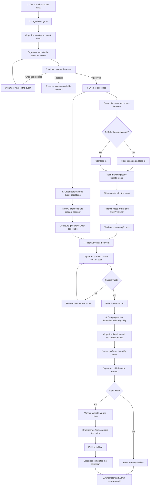

# Tambike Role Process Flow and Browser Smoke Runbook

## Purpose

This document defines the dependency-ordered Tambike MVP process across the
Guest, Rider, Organizer, and Admin experiences. It also provides checkpoints
for a later Codex Browser smoke test.

The MVP has three authenticated account roles: `rider`, `organizer`, and
`admin`. Guest is a public actor, not an account role. There is no Venue role
or public Organizer registration flow.

## Demo accounts

These credentials are for the current demo environment only. Rotate or remove
them before treating the site as a production system.

| Role | Email | Password | Expected landing page |
| --- | --- | --- | --- |
| Organizer | `organizer@bayanko.ph` | `password123` | `/organizer/dashboard` |
| Admin | `admin@bayanko.ph` | `secret_123` | `/admin` |

Riders create their own accounts through `/signup`.

## Existing raffle fixture for browser smoke

Use the existing published event `Tambike at Cafe Classico`
(`/events/tambike-cafe-classico`) for raffle coverage. Do not create a
replacement event for routine browser smoke.

This event currently provides both required public states:

- `Weekend Rider Gear Raffle` is open, approved, and visible on the event page.
- `HJC C10 FOP Helmet Raffle` is completed with a published, verified, and
  fulfilled winner.

The open and completed public campaigns are durable demo fixtures. Routine
smoke tests must inspect them without locking, drawing, cancelling, suspending,
or changing their policy. A test that must execute an irreversible lifecycle
must use a separately approved hidden campaign on an existing event and record
the exact campaign, draw, award, and audit identifiers.

## Dependency-ordered process



## Required order and handoffs

| Order | Owner | Required action | Unlocks |
| ---: | --- | --- | --- |
| 1 | Platform | Organizer and Admin accounts exist | Staff workspace access |
| 2 | Organizer | Create and submit an event | Admin review |
| 3 | Admin | Approve and publish the event | Public discovery and Rider registration |
| 4 | Guest/Rider | Sign up or log in | Profile, RSVP, and pass access |
| 5 | Rider | Register for the published event | QR pass generation |
| 6 | Organizer | Prepare attendees, scanner, and giveaways | Event-day operations |
| 7 | Rider and Organizer/Admin | Present and scan a valid QR pass; staff may use the approved operational override | Confirmed attendance |
| 8 | Organizer/Admin | Lock entries, draw, and publish a winner | Prize claiming |
| 9 | Winner and Organizer/Admin | Submit, verify, and fulfil the claim | Completed giveaway |
| 10 | Organizer/Admin | Open event reports | Final attendance and activity results |

## Role flows and expected routes

### Guest

```text
Open Tambike (/)
-> Browse events (/events)
-> Open a published event (/events/:eventId)
-> View public attendee preview and raffle details
-> Select Register
-> Continue to login or signup
```

Guest checkpoints:

- Public pages load without an authenticated session.
- Only published events are discoverable.
- Registering requires a Rider account.
- Private account and operational data are not shown.

### Rider

```text
Sign up (/signup) or log in (/login)
-> Complete or update profile (/profile)
-> Open a published event (/events/:eventId)
-> Register (/events/:eventId/register)
-> Choose direct arrival or test-ride meetup
-> Choose visible or anonymous RSVP
-> Receive a pass (/passes/:passId)
-> Present the QR pass at the event
-> View past event passes (/passes/past/:eventId)
```

Rider checkpoints:

- Signup creates a Rider account, not an Organizer account.
- A successful registration produces an event-specific pass.
- Profile privacy and RSVP identity rules are respected.
- A pass cannot be checked in twice or used for a different event.

### Organizer

```text
Log in (/login)
-> Open dashboard (/organizer/dashboard)
-> View owned events (/organizer/events)
-> Create event (/organizer/events/create)
-> Submit for Admin review
-> Revise and resubmit if changes are requested
-> Open event workspace (/organizer/events/:eventId)
-> Manage attendees (/organizer/events/:eventId/attendees)
-> Operate scanner (/organizer/events/:eventId/scanner)
-> Manage giveaways (/organizer/events/:eventId/giveaways)
-> View event report (/organizer/events/:eventId/report)
```

Organizer checkpoints:

- Valid demo credentials redirect to `/organizer/dashboard`.
- Only approved Organizers can create and manage events.
- A submitted event is not public until Admin approval.
- Organizer operations are limited to owned events.
- Giveaway drawing and winner selection remain server-authoritative.

### Admin

```text
Log in (/login)
-> Open dashboard (/admin)
-> Open event review queue (/admin/events/review)
-> Review event (/admin/events/review/:reviewId)
-> Approve, reject, or request changes
-> Manage users (/admin/users)
-> Oversee giveaways (/admin/giveaways)
-> Review reports (/admin/reports)
-> Review leads and moderation (/admin/leads, /admin/moderation)
```

Admin checkpoints:

- Valid demo credentials redirect to `/admin`.
- Admin approval makes the event available to Guests and Riders.
- Rejected or change-requested events are not publicly discoverable.
- Admin-only account, review, and moderation data are role-protected.

## Critical dependency rules

1. The Organizer must submit an event before the Admin can review it.
2. The Admin must publish the event before Guests and Riders can discover it.
3. A Rider must authenticate and register before receiving a QR pass.
4. Every check-in requires a valid pass and matching event. Rider self-check-in
   follows the configured event policy and active window; authorized staff
   scanning remains available as an operational override.
5. Giveaway entries must be finalized before the server draws a winner.
6. A published winner must submit a claim before staff can verify fulfilment.
7. Attendance, giveaway, and claim activity must exist before final reports are
   meaningful.

## Browser smoke test levels

### Level 1: Existing-event read-only and authentication smoke

This level may run against the current demo backend without intentionally
creating or changing persistent records.

1. Confirm which checkout and backend the existing dev server is using.
2. Open `/`, `/events`, and `/events/tambike-cafe-classico` as Guest.
3. Confirm the event page shows `Weekend Rider Gear Raffle` under Open raffles
   and `HJC C10 FOP Helmet Raffle` under Recent winners.
4. Log in as Organizer and confirm `/organizer/dashboard` loads.
5. Open `/organizer/events/tambike-cafe-classico/giveaways` and verify the
   completed and open campaign cards, lifecycle, policy, and aggregate report
   without taking an action.
6. Log out.
7. Log in as Admin and confirm `/admin` loads.
8. Open the event review queue, user list, giveaway list, and report list
   without taking an action.
9. Open both Cafe Classico giveaway reviews and verify their sanitized audit
   trails. The completed campaign must include create, review, open, entry,
   lock, selection/draw, publication, claim verification, fulfilment, and
   completion events.
10. Log out and confirm protected pages no longer expose authenticated content.

### Level 2: Persistent raffle action smoke on an existing event

This level changes records. Run it only against an explicitly approved demo
backend and campaign scope. It must reuse an existing event rather than create
a browser-smoke event.

1. Record the approved backend and test-data scope.
2. Select an existing published event and a designated demo Rider that already
   has, or can legitimately obtain, an active RSVP and pass for that event.
3. Do not use the Cafe Classico public open or completed campaign for
   irreversible actions; keep those fixtures available for repeated smoke.
4. Create a hidden or registered-Rider-only test campaign under the selected
   existing event only when full lifecycle execution is explicitly required.
   An opt-in campaign must remain visible to its registered test Rider while it
   is open.
5. Submit and approve the campaign, then open it through the normal Organizer
   and Admin surfaces.
6. Enter the designated Rider through the configured eligibility path and
   verify the Organizer aggregate count.
7. Lock the candidate snapshot and confirm its candidate count and audit event.
8. Execute the configured server-authoritative draw or selection and publish
   the result.
9. Exercise the winner claim, staff verification, fulfilment, and campaign
   completion steps included in the approved scope.
10. Confirm the public, Rider, Organizer, and Admin views agree with the final
    persisted state and sanitized audit trail.
11. Record the campaign, snapshot, draw, award, and audit identifiers. Never
    promise cleanup for completed giveaway history unless a supported,
    separately approved cleanup path exists.

## Verified existing raffle evidence (August 5, 2026)

- The removed `Codex Role Flow Smoke 20260805-967173` event returns 404 and its
  approval, RSVP, pass, check-in, and perk rows are absent.
- Guest view shows the Cafe Classico open raffle and recent fulfilled winner.
- Organizer view shows four persisted campaigns, including the public open and
  completed campaigns; the completed aggregate report shows one locked entry
  and one fulfilled award.
- Admin view shows the completed campaign's 20-event sanitized audit trail from
  creation through completion and the open campaign's six-event trail through
  compliance approval and opening.
- Desktop shows the open raffle and recent winner on the same row with the open
  raffle wider; mobile stacks them without horizontal overflow.
- The isolated smoke Rider cannot opt into Cafe Classico because it is a past
  event and that Rider has no active Cafe Classico RSVP/pass. Executing a new
  opt-in requires an approved credentialed Rider already registered for that
  event, or a hidden campaign on another existing upcoming event.

## Verified full raffle lifecycle on an existing event (August 5, 2026)

The Level 2 smoke completed on the existing published event `Makina Moto Expo
Cebu` (`makina-moto-expo-cebu`). It had no attendees before the smoke. The
test registered one isolated Rider through the normal event UI, which produced
one active RSVP and this pass:

- `pass-makina-moto-expo-cebu-user-codex-rider-20260805-967173-example-com`

The browser then completed the Organizer, Admin, Rider, presentation-stage,
and claim-desk flow for `Makina Cebu Rider Kit Raffle`. The campaign was
restricted to registered Riders, so it was available to the enrolled test
Rider without being exposed to ordinary Guests.

| Record | Verified identifier or state |
| --- | --- |
| Campaign | `giveaway-88c6774a-6dbf-4f25-9dc3-6117a7ecd80b` · `completed` · compliance `approved` |
| Entry | `giveaway-entry-734b541b-e3f8-4b89-80a4-9e3b23f5c03a` · opt-in · locked |
| Candidate snapshot | `giveaway-snapshot-481a131c-65f6-423e-88ea-ab1536f3a600` · one candidate · `hmac-sha256-v1` |
| Draw | `giveaway-draw-ce2f86ee-2c84-4306-b2a8-bb865686f1dd` · published |
| Award | `giveaway-award-1fb3103a-b734-49be-b860-de400d398b5c` · fulfilled |
| Winner-safe label | `Rider 3B4F` |
| Audit trail | 17 ordered events, ending with `GIVEAWAY_COMPLETED` |

Verified browser checkpoints:

1. Rider registration issued the event pass and the opt-in action recorded one
   campaign entry.
2. Organizer locked one candidate and ran the deterministic random draw.
3. The separate presentation stage connected, revealed `Rider 3B4F`, and the
   Organizer published the result.
4. The winning Rider opened the award claim and issued a private claim QR.
5. Organizer claim desk found the credential, verified it, and recorded the
   prize as fulfilled.
6. Organizer explicitly completed the campaign; the Rider claim page showed
   `Prize fulfilled`, and Admin showed `Completed` plus the 17-event sanitized
   audit chain.

The Cafe Classico fixtures were not changed. The Makina event now intentionally
retains one attendee/pass and the completed campaign, entry, snapshot, draw,
award, fulfillment, and audit history. No cleanup was promised or attempted.

## Browser test evidence to capture

For each checkpoint, record:

- actor and account role;
- starting URL;
- action performed;
- resulting URL;
- visible success or error state;
- whether the step was read-only or persistent;
- event, pass, giveaway, or claim identifier when applicable;
- desktop or mobile viewport used;
- any console or server error relevant to the step.

Use the Codex Browser surface for browser verification. Before starting another
development server, check for and reuse an existing Tambike server process.
